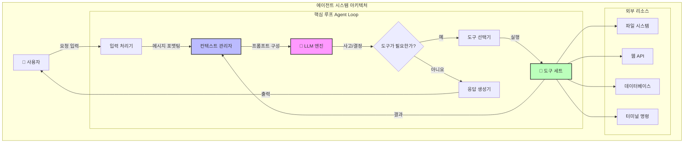
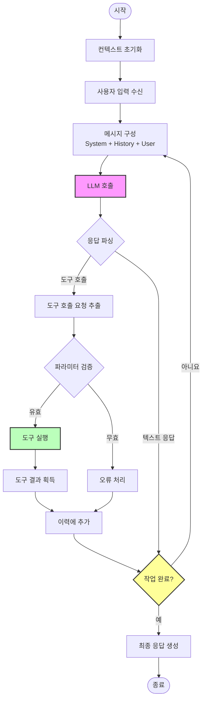
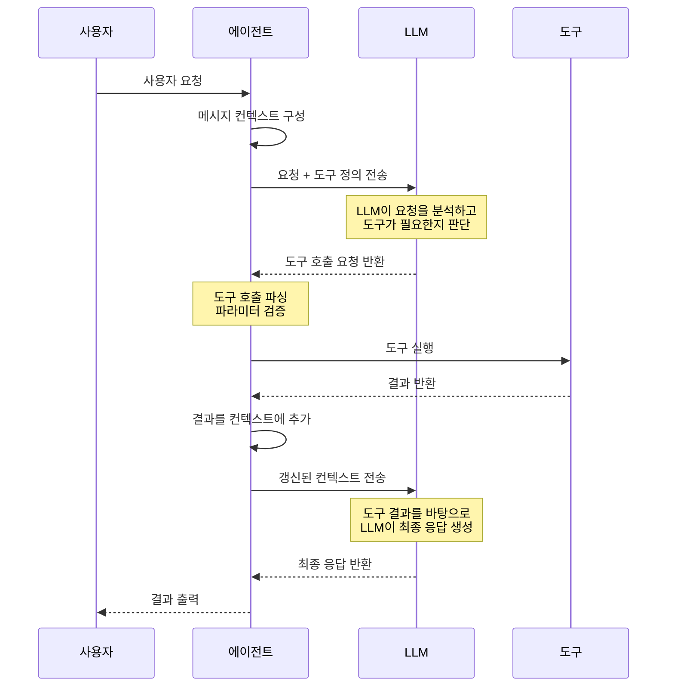
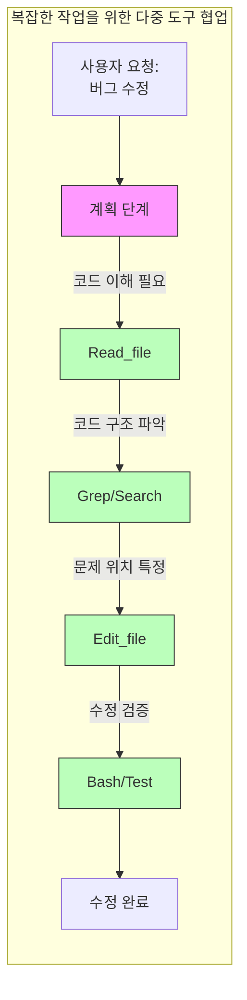
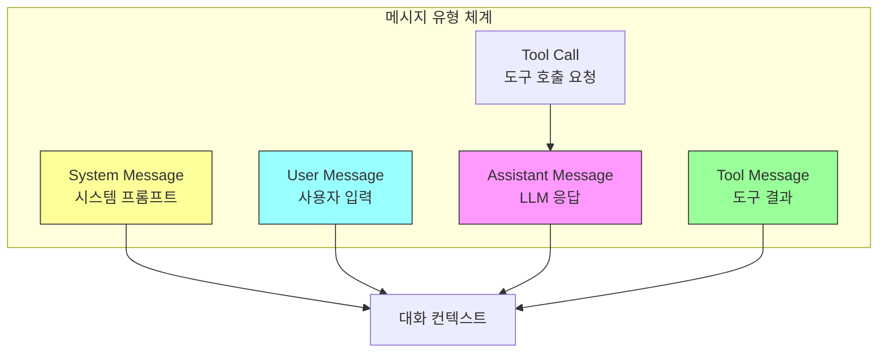
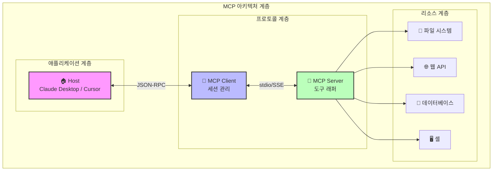
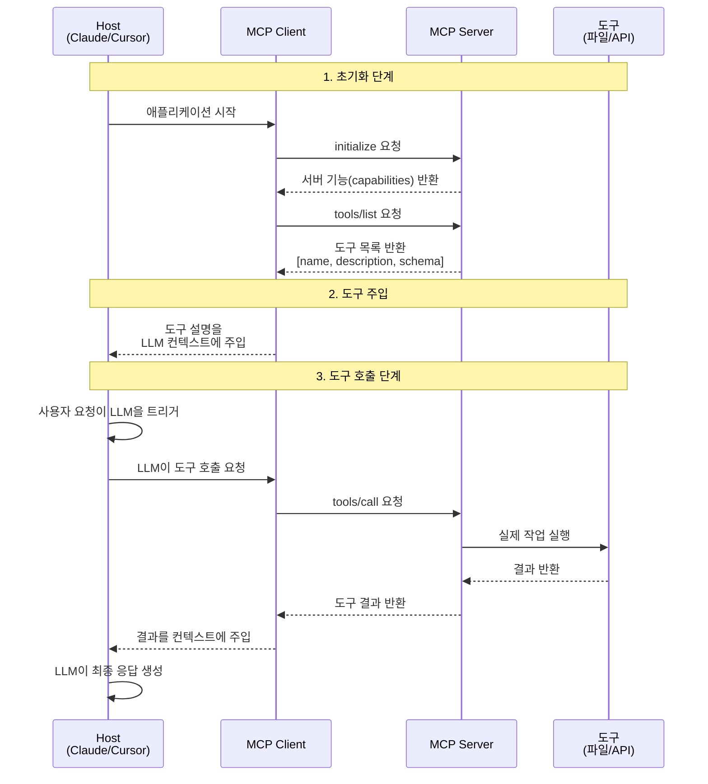
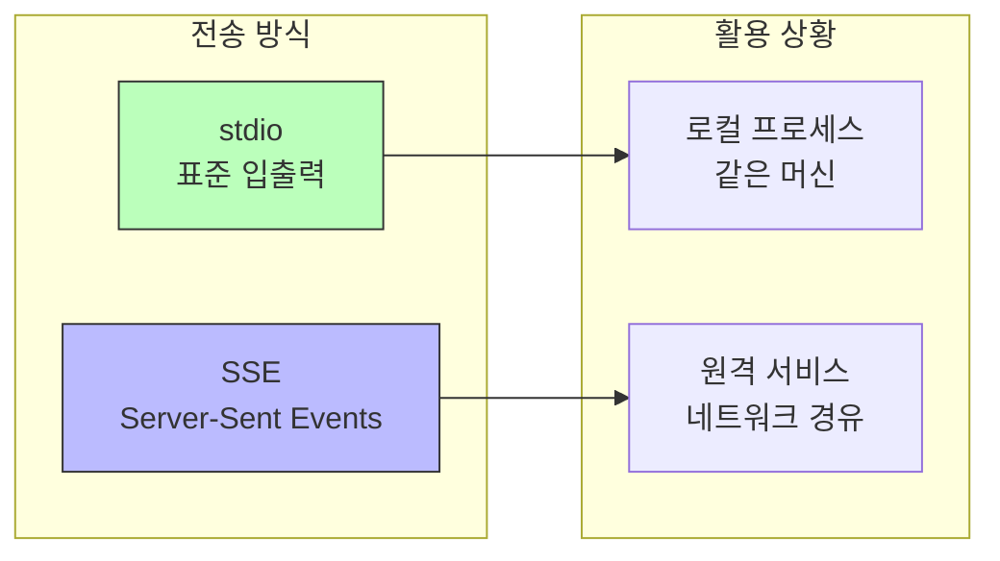
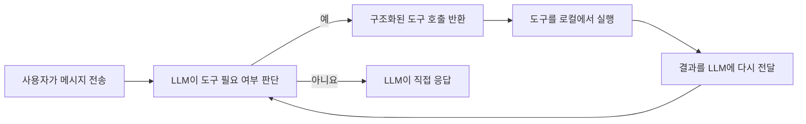

# 2장: 코딩 에이전트 아키텍처

## 강의 개요

에이전트는 AI 프로그래밍의 핵심 역량입니다. 그 밑바탕의 원리를 이해하면 도구를 더 잘 활용할 수 있습니다.

### 학습 목표
- 에이전트 아키텍처의 핵심 구성요소 이해
- 도구 사용(tool use)과 함수 호출(function calling) 메커니즘 숙지
- MCP(Model Context Protocol) 학습
- 간단한 코딩 에이전트를 밑바닥부터 구현

---

## 1. 코딩 에이전트란?

```
Agent = LLM + Tools + Loop
(에이전트 = LLM + 도구 + 루프)
```

- **LLM**은 추론과 의사결정을 담당
- **도구(Tools)** 는 에이전트가 외부 세계와 상호작용할 수 있게 함
- **루프(Loop)** 는 작업이 완료될 때까지 에이전트가 계속 일하게 함

### 에이전트 아키텍처의 핵심 단계

```
1. 사용자 입력을 읽음 → 대화에 추가
2. 사용 가능한 도구를 LLM에 알려줌 (Read_file, List_dir, Edit_file, Create_file)
3. LLM이 적절한 시점에 도구 사용을 요청
4. 도구를 로컬에서 실행하고 결과를 반환
5. 작업이 완료될 때까지 대화를 계속
```

---

## 2. 에이전트 아키텍처 심층 분석

### 2.1 전체 아키텍처

에이전트의 핵심은 **인지(Perceive)-사고(Think)-행동(Act)** 루프 시스템으로, **ReAct(Reasoning + Acting)** 패턴이라고도 합니다.



### 2.2 핵심 구성요소

| 구성요소 | 역할 | 주요 특징 |
|----------|------|-----------|
| **입력 처리기** | 사용자 요청 해석, 의도 추출 | 다양한 입력 형식 지원 |
| **컨텍스트 관리자** | 대화 이력과 상태 관리 | 컨텍스트 윈도우 최적화 |
| **LLM 엔진** | 핵심 의사결정과 추론 | 여러 모델 지원 |
| **도구 선택기** | 의도에 맞는 도구 선택 | 동적 도구 탐색 |
| **도구 세트** | 구체적인 작업 실행 | 확장 가능한 구조 |
| **응답 생성기** | 최종 응답 생성 | 다양한 출력 형식 |

---

## 3. 에이전트 루프 심층 분석

### 3.1 에이전트 루프 워크플로

에이전트 루프는 에이전트가 작업을 반복적으로 처리하는 방식을 결정하는 핵심 실행 메커니즘입니다.



### 3.2 에이전트 루프 의사코드 구현

```python
def agent_loop(user_input: str, tools: list[Tool], max_iterations: int = 10):
    """
    에이전트 메인 루프 구현
    """
    # 1. 컨텍스트 초기화
    messages = [
        {"role": "system", "content": SYSTEM_PROMPT},
        {"role": "user", "content": user_input}
    ]

    # 2. 루프 시작
    for iteration in range(max_iterations):
        # 3. LLM 호출
        response = llm.chat(
            messages=messages,
            tools=tools,  # 사용 가능한 도구를 LLM에 알려줌
        )

        # 4. 도구 호출이 필요한지 확인
        if response.tool_calls:
            # 5. 모든 도구 호출 실행
            for tool_call in response.tool_calls:
                # 도구 실행
                result = execute_tool(tool_call.name, tool_call.args)

                # 결과를 메시지 이력에 추가
                messages.append({
                    "role": "tool",
                    "tool_call_id": tool_call.id,
                    "content": result
                })

            # 루프를 계속하여 LLM이 도구 결과를 처리하게 함
            continue

        # 6. 도구 호출이 없으면 완료 여부 확인
        if is_task_complete(response):
            return response.content

        # 7. 그렇지 않으면 대화 계속
        messages.append({"role": "assistant", "content": response.content})

    return "Max iterations reached, task incomplete"
```

### 3.3 주요 루프 파라미터

| 파라미터 | 설명 | 권장값 |
|----------|------|--------|
| `max_iterations` | 무한 루프를 막기 위한 최대 반복 횟수 | 10-50 |
| `timeout` | LLM 1회 호출의 제한 시간 | 30-120초 |
| `context_window` | 컨텍스트 윈도우 크기 | 모델에 따라 다름 |
| `retry_count` | 오류 시 재시도 횟수 | 3 |

---

## 4. 도구 호출 메커니즘 심층 분석

### 4.1 도구 호출 흐름



### 4.2 도구 정의 형식

도구는 JSON Schema로 정의하며, 이름·설명·파라미터 명세를 포함합니다.

```json
{
  "name": "read_file",
  "description": "Read file content at specified path",
  "parameters": {
    "type": "object",
    "properties": {
      "file_path": {
        "type": "string",
        "description": "Absolute path of the file"
      },
      "offset": {
        "type": "integer",
        "description": "Starting line number, optional"
      },
      "limit": {
        "type": "integer",
        "description": "Number of lines to read, optional"
      }
    },
    "required": ["file_path"]
  }
}
```

### 4.3 도구 호출 예시

```json
// LLM이 도구 호출을 요청
{
  "tool_calls": [
    {
      "id": "call_abc123",
      "type": "function",
      "function": {
        "name": "read_file",
        "arguments": "{\"file_path\": \"/src/main.py\"}"
      }
    }
  ]
}

// 도구 실행 결과를 LLM에 반환
{
  "role": "tool",
  "tool_call_id": "call_abc123",
  "content": "def main():\n    print('Hello, World!')\n"
}
```

### 4.4 여러 도구의 협업 흐름



---

## 5. 메시지 유형과 컨텍스트 관리

### 5.1 메시지 유형



### 5.2 컨텍스트 윈도우 관리 전략

| 전략 | 설명 | 활용 상황 |
|------|------|-----------|
| **슬라이딩 윈도우** | 최근 N개의 메시지만 유지 | 단순한 대화 |
| **요약** | 이력을 요약으로 압축 | 긴 대화 |
| **의미 기반 검색** | 관련된 과거 메시지를 검색해 사용 | 복잡한 작업 |
| **우선순위 큐** | 중요도에 따라 메시지 유지 | 다중 작업 상황 |

---

## 6. 용어 정리

| 용어 | 설명 |
|------|------|
| **System Prompt (시스템 프롬프트)** | LLM의 전반적인 행동과 일부 지침을 정의 |
| **User Prompt (사용자 프롬프트)** | 사용자의 개별 요청 |
| **Assistant Prompt (어시스턴트 프롬프트)** | LLM의 응답 |
| **Tool Call (도구 호출)** | LLM이 시작하는 도구 호출 요청 |
| **Tool Result (도구 결과)** | 도구 실행 후 반환되는 결과 |
| **Context Window (컨텍스트 윈도우)** | LLM이 처리할 수 있는 최대 토큰 수 |
| **Agent Loop (에이전트 루프)** | 에이전트의 반복 실행 루프 |

### Claude의 비법 (Secret Sauce)

1. **컨텍스트를 앞에 배치하기** - 작고 목표가 분명한 프롬프트로 컨텍스트를 미리 로드
2. **System-reminder 태그** - 곳곳에 <system-reminder>를 사용해 방향 이탈(drift) 방지
3. **명령어 접두사 추출** - 사용자 명령을 명확하게 추출
4. **서브에이전트** - 서브에이전트를 생성해 컨텍스트 과부하 방지

---

## 7. 도구 사용과 함수 호출

### 함수 호출 원리

```json
{
  "name": "get_weather",
  "description": "Get weather information for specified city",
  "parameters": {
    "type": "object",
    "properties": {
      "city": { "type": "string", "description": "City name" }
    },
    "required": ["city"]
  }
}
```

### 자주 쓰는 도구
- **Read_file** - 파일 내용 읽기
- **List_dir** - 디렉터리 내용 나열
- **Edit_file** - 파일 편집
- **Create_file** - 새 파일 생성

### 워크플로

1. 도구 이름, 설명, 파라미터 스키마를 정의
2. LLM이 사용자 요청에 따라 도구 호출 시점을 결정
3. 도구를 실행하고 결과를 LLM에 반환
4. LLM이 응답 생성을 계속하거나 추가 도구를 요청

---

## 8. MCP (Model Context Protocol)

### 8.1 왜 MCP인가?

- LLM은 방대하지만 정적인 세계 지식을 갖고 있으며, 재학습할 때만 갱신됨
- 완전 자율 시스템을 만들려면 동적 데이터를 공급하는 견고한 방법이 필요함

**동적 데이터의 예**:
- 오늘 날씨는 어떤가?
- 현재 대통령은 누구인가?
- 비트코인 가격은 얼마인가?
- Nike 최신 광고 캠페인의 내레이터는 누구인가?

RAG와 도구 호출이 현재로서는 최선의 해답입니다.

### 8.2 MCP의 정의

> Model Context Protocol: 시스템이 범용적인 방식으로 AI 모델에 컨텍스트를 제공할 수 있게 하는 프로토콜

### 8.3 MCP 전체 아키텍처



### 8.4 MCP 통신 흐름 심층 분석



### 8.5 MCP의 장점

| 장점 | 설명 |
|------|------|
| **표준화** | JSON-RPC를 사용한 통일된 도구 설명 형식 |
| **확장성** | MCP Server로 어떤 도구든 감쌀 수 있음 |
| **통합 비용 감소** | M x N → M + N |
| **LSP 계승** | Language Server Protocol을 확장한 구조 |
| **능동적 워크플로** | 단순한 반응형 응답이 아닌 능동적 에이전트 워크플로 지원 |

### 8.6 MCP 핵심 구성요소

| 구성요소 | 설명 |
|----------|------|
| **Host** | Cursor, Claude Desktop 같은 AI IDE |
| **MCP Client** | Host에 내장된 라이브러리 (서버마다 상태를 가진 세션 유지) |
| **MCP Server** | 도구 앞에 놓이는 경량 래퍼 |
| **Tool** | 호출 가능한 함수 (데이터 소스, API 등) |

### 8.7 MCP 도구 정의 예시

```json
{
  "name": "read_file",
  "description": "Read the contents of a local file",
  "inputSchema": {
    "type": "object",
    "properties": {
      "path": {
        "type": "string",
        "description": "The path of the file to read"
      }
    },
    "required": ["path"]
  }
}
```

### 8.8 MCP 전송 계층



### 8.9 MCP의 한계

- **도구 처리 능력의 한계**: 에이전트는 도구가 많아지면 잘 다루지 못함
- **컨텍스트 윈도우 소모**: API 설명이 컨텍스트 윈도우를 빠르게 잠식함
- **AI 네이티브 설계**: API를 AI가 사용한다는 점을 염두에 두고 설계해야 함

---

## 9. 코딩 에이전트를 밑바닥부터 만들기: 200줄의 비밀

> 이 절은 Mihail Eric의 글 ["The Emperor Has No Clothes: How to Code Claude Code in 200 Lines of Code"](https://www.mihaileric.com/The-Emperor-Has-No-Clothes/)를 바탕으로 합니다.

### 9.1 핵심 통찰

오늘날의 AI 코딩 어시스턴트는 마법처럼 느껴집니다. 겨우 말이 되는 수준의 영어로 원하는 것을 설명하면, 파일을 읽고 프로젝트를 편집하고 동작하는 코드를 작성합니다.

하지만 진실은 이렇습니다. **이런 도구의 핵심은 마법이 아닙니다. 약 200줄의 단순한 Python 코드입니다.**

### 9.2 멘탈 모델

코딩 에이전트를 이해하는 열쇠는, 그것이 본질적으로 **도구 상자를 가진 LLM과의 대화**일 뿐이라는 점을 깨닫는 것입니다.



**핵심 통찰**: LLM은 실제로 파일 시스템을 건드리지 않습니다. 단지 무언가를 해 달라고 요청할 뿐이고, 실제로 실행하는 것은 여러분의 코드입니다.

### 9.3 세 가지 핵심 도구

최소한의 코딩 에이전트에는 도구 세 개만 있으면 됩니다.

| 도구 | 기능 | 필요한 이유 |
|------|------|-------------|
| **read_file** | 파일 내용 읽기 | LLM이 코드를 볼 수 있게 함 |
| **list_files** | 디렉터리 내용 나열 | LLM이 프로젝트 구조를 탐색할 수 있게 함 |
| **edit_file** | 파일 편집/생성 | LLM이 코드를 수정할 수 있게 함 |

실제 제품 수준의 에이전트(Claude Code 등)에는 더 많은 도구(grep, bash, websearch 등)가 있지만, 도구 세 개만으로도 놀라운 일을 해낼 수 있습니다.

### 9.4 코드 구현

#### 기본 설정

```python
import inspect
import json
import os
import anthropic
from dotenv import load_dotenv
from pathlib import Path
from typing import Any, Dict, List, Tuple

load_dotenv()
claude_client = anthropic.Anthropic(api_key=os.environ["ANTHROPIC_API_KEY"])

# 터미널 색상 출력
YOU_COLOR = "\u001b[94m"
ASSISTANT_COLOR = "\u001b[93m"
RESET_COLOR = "\u001b[0m"

def resolve_abs_path(path_str: str) -> Path:
    """상대 경로를 절대 경로로 변환"""
    path = Path(path_str).expanduser()
    if not path.is_absolute():
        path = (Path.cwd() / path).resolve()
    return path
```

#### 도구 1: 파일 읽기

```python
def read_file_tool(filename: str) -> Dict[str, Any]:
    """
    Gets the full content of a file provided by the user.
    :param filename: The name of the file to read.
    :return: The full content of the file.
    """
    full_path = resolve_abs_path(filename)
    with open(str(full_path), "r") as f:
        content = f.read()
    return {
        "file_path": str(full_path),
        "content": content
    }
```

#### 도구 2: 파일 목록 보기

```python
def list_files_tool(path: str) -> Dict[str, Any]:
    """
    Lists the files in a directory provided by the user.
    :param path: The path to a directory to list files from.
    :return: A list of files in the directory.
    """
    full_path = resolve_abs_path(path)
    all_files = []
    for item in full_path.iterdir():
        all_files.append({
            "filename": item.name,
            "type": "file" if item.is_file() else "dir"
        })
    return {
        "path": str(full_path),
        "files": all_files
    }
```

#### 도구 3: 파일 편집

```python
def edit_file_tool(path: str, old_str: str, new_str: str) -> Dict[str, Any]:
    """
    Replaces first occurrence of old_str with new_str in file.
    If old_str is empty, create/overwrite file with new_str.
    """
    full_path = resolve_abs_path(path)
    if old_str == "":
        full_path.write_text(new_str, encoding="utf-8")
        return {"path": str(full_path), "action": "created_file"}

    original = full_path.read_text(encoding="utf-8")
    if original.find(old_str) == -1:
        return {"path": str(full_path), "action": "old_str not found"}

    edited = original.replace(old_str, new_str, 1)
    full_path.write_text(edited, encoding="utf-8")
    return {"path": str(full_path), "action": "edited"}
```

> 참고: 도구 함수의 docstring은 LLM에게 도구 사용법을 알려 주는 데 그대로 쓰이므로 원문(영어)을 유지했습니다.

#### 도구 레지스트리

```python
TOOL_REGISTRY = {
    "read_file": read_file_tool,
    "list_files": list_files_tool,
    "edit_file": edit_file_tool
}
```

#### 시스템 프롬프트

```python
SYSTEM_PROMPT = """
You are a coding assistant whose goal it is to help us solve coding tasks.
You have access to a series of tools you can execute. Here are the tools you can execute:
{tool_list_repr}
When you want to use a tool, reply with exactly one line in the format:
'tool: TOOL_NAME({{JSON_ARGS}})' and nothing else.
Use compact single-line JSON with double quotes. After receiving a tool_result(...)
message, continue the task.
If no tool is needed, respond normally.
"""
```

#### 도구 호출 파싱

```python
def extract_tool_invocations(text: str) -> List[Tuple[str, Dict[str, Any]]]:
    """
    'tool: name({...})' 형식의 줄에서 도구 호출을 추출
    """
    invocations = []
    for raw_line in text.splitlines():
        line = raw_line.strip()
        if not line.startswith("tool:"):
            continue
        try:
            after = line[len("tool:"):].strip()
            name, rest = after.split("(", 1)
            name = name.strip()
            if not rest.endswith(")"):
                continue
            json_str = rest[:-1].strip()
            args = json.loads(json_str)
            invocations.append((name, args))
        except Exception:
            continue
    return invocations
```

#### 에이전트 루프

```python
def run_coding_agent_loop():
    conversation = [{
        "role": "system",
        "content": get_full_system_prompt()
    }]

    while True:
        # 사용자 입력 받기
        user_input = input(f"{YOU_COLOR}You:{RESET_COLOR}:")
        conversation.append({
            "role": "user",
            "content": user_input.strip()
        })

        # 내부 루프: 도구 호출 처리
        while True:
            assistant_response = execute_llm_call(conversation)
            tool_invocations = extract_tool_invocations(assistant_response)

            if not tool_invocations:
                # 도구 호출이 없으면 응답 출력
                print(f"{ASSISTANT_COLOR}Assistant:{RESET_COLOR}: {assistant_response}")
                conversation.append({
                    "role": "assistant",
                    "content": assistant_response
                })
                break

            # 모든 도구 호출 실행
            for name, args in tool_invocations:
                tool = TOOL_REGISTRY[name]
                result = tool(**args)
                conversation.append({
                    "role": "user",
                    "content": f"tool_result({json.dumps(result)})"
                })
```

### 9.5 실행 예시

```
You: hello world를 구현한 hello.py 파일을 만들어줘

Agent calls: edit_file(path="hello.py", old_str="", new_str="print('Hello World')")

Assistant: 완료! hello world를 구현한 hello.py를 만들었습니다.

You: hello.py를 수정해서 두 수를 곱하는 함수를 추가해줘

Agent calls: read_file(filename="hello.py")  # 현재 내용 확인
Agent calls: edit_file(path="hello.py", old_str="...", new_str="...")

Assistant: hello.py에 multiply 함수를 추가했습니다.
```

### 9.6 실제 제품 도구와의 비교

| 기능 | 우리의 구현 | Claude Code 같은 실제 제품 |
|------|-------------|----------------------------|
| 핵심 루프 | ✓ 동일 | ✓ 동일 |
| 오류 처리 | 기본 수준 | 포괄적 |
| 스트리밍 출력 | ✗ | ✓ |
| 컨텍스트 관리 | 기본 수준 | 지능형 (긴 파일 요약 등) |
| 도구 수 | 3개 | 더 많음 (bash, grep, websearch 등) |
| 승인 워크플로 | ✗ | ✓ (파괴적 작업은 확인 요청) |
| 코드 줄 수 | 약 200줄 | 수천 줄 |

**핵심 결론**: 실제 제품 도구는 많은 엔지니어링 세부 사항을 더하지만, 핵심 아키텍처는 정확히 이 루프입니다. LLM이 무엇을 할지 결정하고, 코드가 실행하고, 결과가 다시 돌아옵니다. 이것이 아키텍처의 전부입니다.

### 9.7 핵심 요점

1. **도구 설명이 중요하다**: 함수의 docstring이 LLM에게 도구 사용법을 알려 주는 데 그대로 사용됨
2. **구조화된 반환값**: 도구는 딕셔너리를 반환함. LLM에게는 구조화된 컨텍스트가 필요함
3. **설정보다 관례**: 예를 들어 `old_str=""`은 새 파일 생성을 의미
4. **루프가 전부다**: 외부 루프는 사용자 입력을 받고, 내부 루프는 연쇄적인 도구 호출을 처리

---

## 10. 실습 과제

### 실습 1: 에이전트 루프 이해하기
Claude 또는 Cursor의 에이전트가 다음을 어떻게 수행하는지 관찰하세요.
1. 사용자 요청 수신
2. 사용할 도구 결정
3. 도구 실행 및 결과 처리
4. 작업이 완료될 때까지 계속 진행

### 실습 2: MCP 탐색하기
1. Cursor 또는 Claude Desktop에서 사용 가능한 MCP 확인
2. 새 MCP Server 추가해 보기
3. 도구가 LLM에게 어떻게 설명되는지 관찰

### 실습 3: 간단한 에이전트 만들기
간단한 코딩 에이전트를 밑바닥부터 만들어 보세요.
1. LLM API 설정
2. 사용 가능한 도구 정의
3. 에이전트 루프 구현
4. 기본 기능 테스트

### 실습 4: 에이전트 기능 확장하기
9절의 코드를 바탕으로 다음 기능을 추가해 보세요.
1. 코드 내용을 검색하는 `grep_search` 도구 추가
2. 명령을 실행하는 `run_bash` 도구 추가
3. 스트리밍 출력 구현
4. 작업 확인(승인) 메커니즘 추가

---

## 강의 자료

### 강의 3: 코딩 에이전트를 밑바닥부터 만들기
- [슬라이드 (PDF)](../../slides/week2-lecture1-coding-agent-scratch.pdf)

### 강의 4: 커스텀 MCP 서버 만들기
- [슬라이드 (PDF)](../../slides/week2-lecture2-mcp-server.pdf)

---

## 읽기 자료

1. **[The Emperor Has No Clothes: How to Code Claude Code in 200 Lines of Code](https://www.mihaileric.com/The-Emperor-Has-No-Clothes/)** - Mihail Eric
2. **[MCP 소개 (MCP Introduction)](https://stytch.com/blog/model-context-protocol-introduction/)**
3. **[MCP Server 예제 구현 (Sample MCP Server Implementations)](https://github.com/modelcontextprotocol/servers)**

---

## 과제

**[2장 과제](https://github.com/mihail911/modern-software-dev-assignments/tree/master/week2)**

AI IDE에서 개발 과제를 수행합니다.

---

## 다음 장

[다음 장: 3장](./chapter3.md)

---
