# 3장: AI 통합 개발 환경

## 강의 개요

AI IDE의 본질은 대체가 아니라 증강(augmentation)입니다. 컨텍스트의 품질이 출력의 품질을 결정합니다.

### 학습 목표
- AI IDE의 작동 방식 이해
- AI IDE 모범 사례 숙지
- 동기(sync) vs 비동기(async) 도구의 활용 상황 학습
- 2025년의 프로그래밍 워크플로 이해

---

## 1. 왜 IDE인가?

### 1.1 IDE의 정의

**IDE(Integrated Development Environment, 통합 개발 환경)** 는 소프트웨어 개발을 위한 올인원 작업 공간으로, 다음을 포함합니다.
- 코드 에디터
- 컴파일러
- 디버거
- 그 밖의 개발 도구

### 1.2 AI 강화 IDE가 자연스러운 진화인 이유


### 1.3 IDE 진화의 핵심 긴장 관계

IDE의 진화에는 항상 다음 두 방향 사이의 긴장이 존재합니다.

| 방향 | 설명 |
|------|------|
| **기능 통합** | 더 많은 기능을 하나의 도구에 통합 |
| **개발자 맞춤화** | 개발자가 도구를 자유롭게 선택하고 설정하도록 허용 |

---

## 2. AI IDE 발전사

### 2.1 연대표

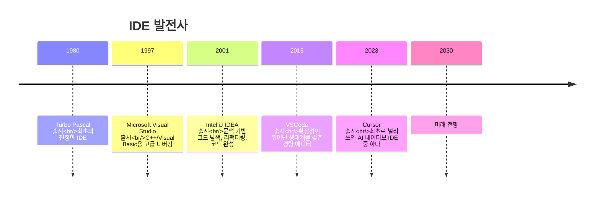

### 2.2 주요 이정표

| 연도 | 제품 | 핵심 혁신 |
|------|------|-----------|
| 1980 | Turbo Pascal | 최초의 진정한 IDE, 편집·컴파일·디버깅 통합 |
| 1997 | Visual Studio | C++/Visual Basic용 고급 디버깅 기능 |
| 2001 | IntelliJ IDEA | 문맥 기반 코드 탐색, 리팩터링, 지능형 완성 |
| 2015 | VSCode | 경량 + 확장성이 뛰어난 생태계 |
| 2023 | Cursor | 최초로 널리 쓰인 AI 네이티브 IDE 중 하나 |

---

## 3. AI IDE의 두 가지 모드

### 3.1 기본 모드 (Bread-and-butter Modes)

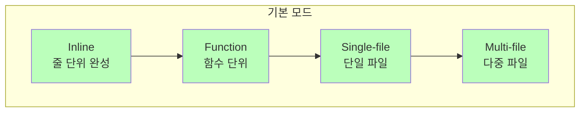

| 모드 | 설명 | 대표적 사용 사례 |
|------|------|------------------|
| **Inline** | 인라인 코드 완성 | 한 줄을 빠르게 완성 |
| **Function** | 함수 단위 생성 | 함수 전체 구현 생성 |
| **Single-file** | 단일 파일 작업 | 파일 하나를 리팩터링 |
| **Multi-file** | 다중 파일 작업 | 파일을 넘나드는 리팩터링과 수정 |

### 3.2 진정한 AI 네이티브 모드

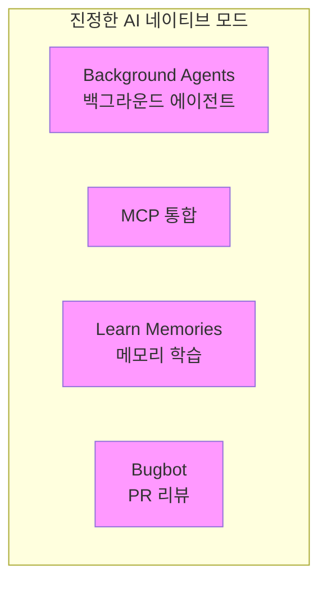

| 기능 | 설명 |
|------|------|
| **Background Agents** | 백그라운드에서 실행되며 여러 작업을 병렬로 처리할 수 있는 AI 에이전트 |
| **MCP 통합** | MCP 프로토콜을 통합하여 도구 기능 확장 |
| **Learn Memories** | AI가 프로젝트 고유의 컨텍스트를 학습하고 기억 |
| **Bugbot** | PR 자동 리뷰, 잠재적 문제 발견 |

---

## 4. AI IDE의 작동 방식

### 4.1 탭 완성 (Tab Complete, 코드 완성)

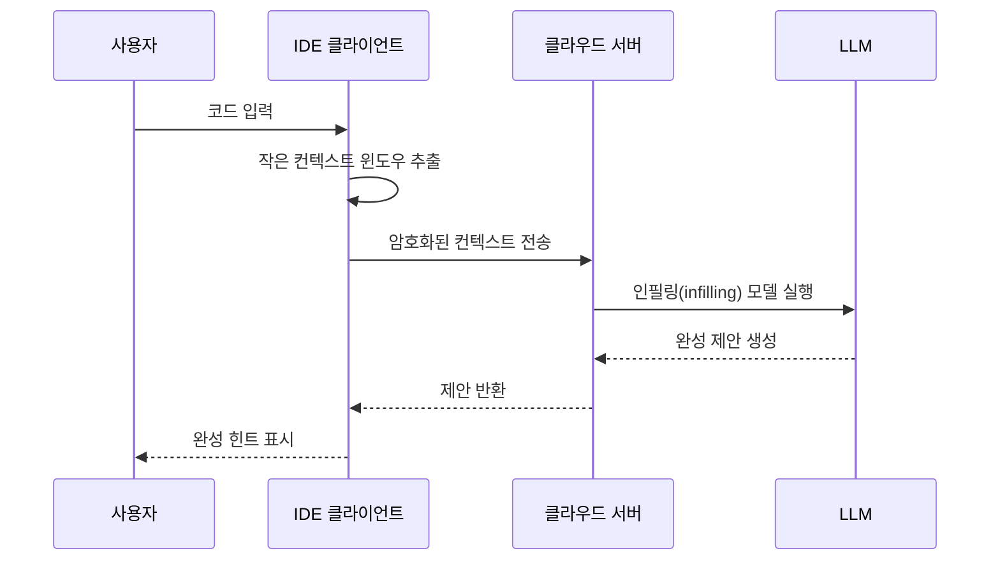

**워크플로:**
1. 현재 코드 주변의 작은 컨텍스트 윈도우를 암호화
2. 서버가 이를 받아 인필링 LLM을 실행
3. 제안이 다시 전송되어 사용자에게 표시됨

### 4.2 채팅 모드

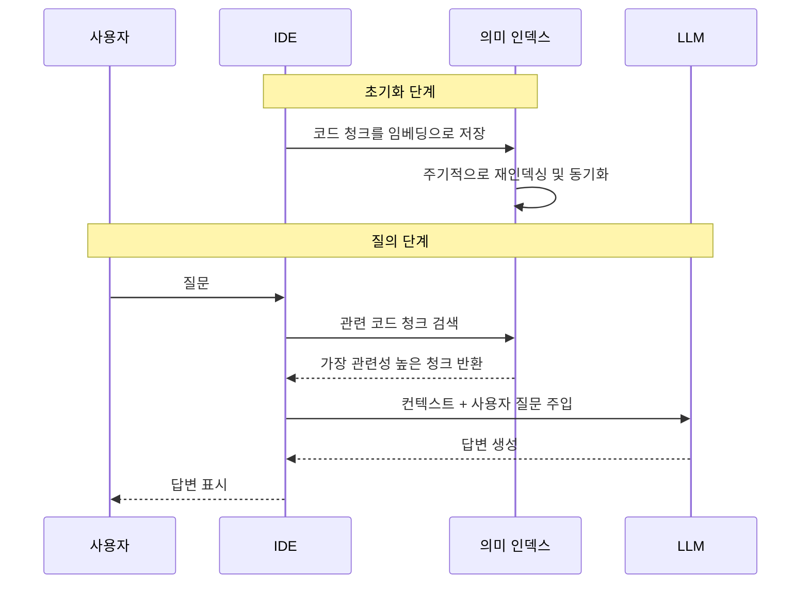

**핵심 기술:**

| 기술 | 설명 |
|------|------|
| **코드 청킹 (Code Chunking)** | 코드를 의미 단위로 나누어 저장 |
| **임베딩 (Embeddings)** | 코드 블록의 벡터 표현, 의미 기반 검색 지원 |
| **의미 인덱스 (Semantic Index)** | 퍼지(fuzzy) 검색을 지원하는 인덱스 구조 |
| **머클 트리 (Merkle Trees)** | 코드 차이를 효율적으로 계산해 동기화 최적화 |
| **파일명 난독화** | 실제 파일명을 노출하지 않아 개인정보 보호 |

### 4.3 컨텍스트 관리

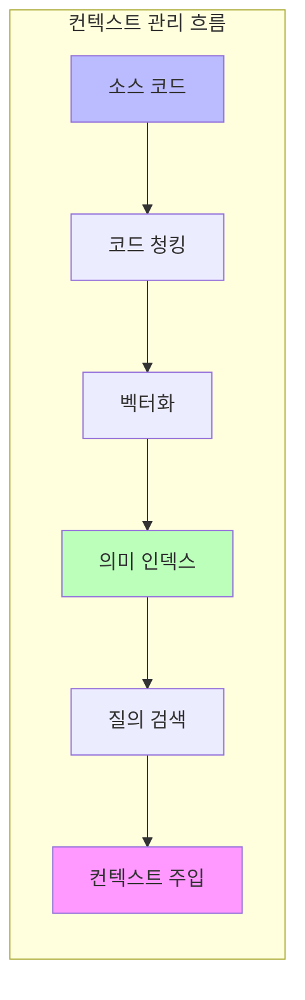

---

## 5. 동기 vs 비동기 도구

### 5.1 AI 코딩 도구의 세 시대

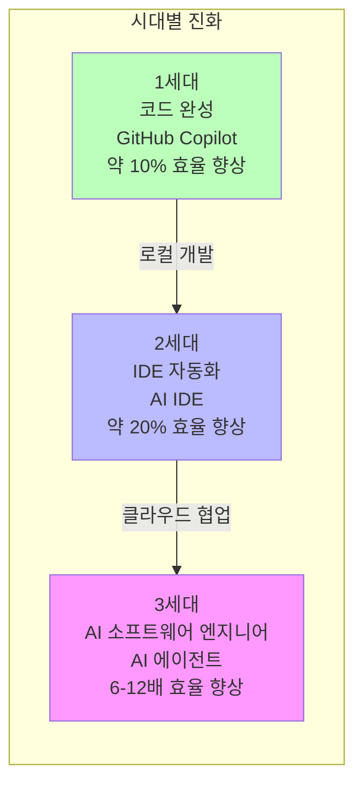

| 세대 | 도구 유형 | 대표 제품 | 효율 향상 | 특징 |
|------|-----------|-----------|-----------|------|
| 1 | 코드 완성 | GitHub Copilot | 약 10% | 코드 완성, 로컬 개발 |
| 2 | IDE 자동화 | Cursor, Windsurf | 약 20% | 단일 작업 완수, 로컬 동기 |
| 3 | AI 소프트웨어 엔지니어 | Devin | 6-12배 | 다중 작업 병렬, 클라우드 비동기 |

### 5.2 동기(Sync) 모드

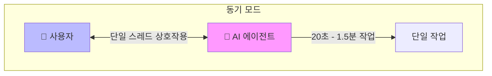

**특징:**
- **단일 스레드**: 한 번에 하나의 작업을 처리
- **Human-in-the-loop**: 사람이 의사결정에 지속적으로 참여
- **집중된 주의**: 하나의 작업에 집중
- **AI 작업 시간**: 20초 - 1.5분
- **몰입(flow) 상태 유지**

**로컬 도구**: Windsurf, Cursor

### 5.3 비동기(Async) 모드

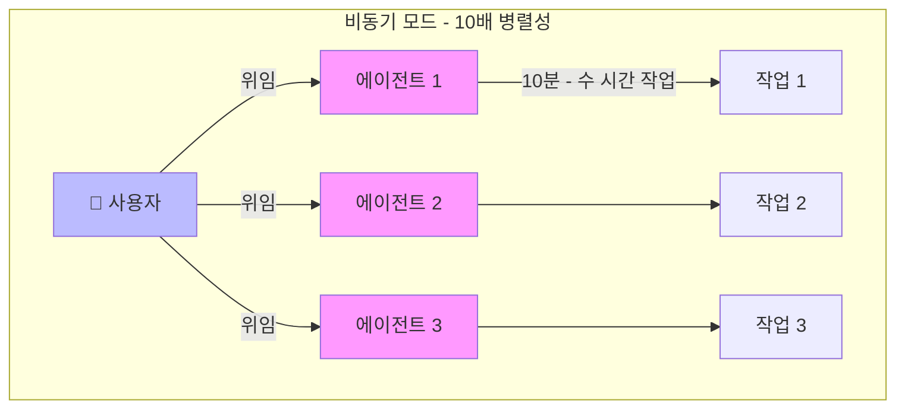

**특징:**
- **다중 스레드**: 여러 작업을 동시에 처리
- **사람은 위임**: 작업을 맡긴 뒤 다른 곳으로 주의를 전환
- **주의 전환**: 여러 작업 사이를 오가며 진행
- **AI 작업 시간**: 10분 - 수 시간
- **10배 병렬성**

**클라우드 도구**: Devin, DeepWiki, Codemaps

### 5.4 로컬 vs 클라우드 비교

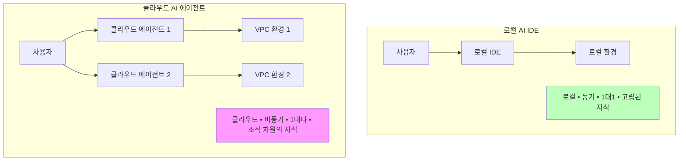

| 구분 | 로컬 AI IDE | 클라우드 AI 에이전트 |
|------|-------------|----------------------|
| 위치 | 로컬 | 클라우드 VPC |
| 모드 | 동기 | 비동기 |
| 관계 | 1대1 | 1대다 |
| 지식 | 고립됨 | 조직 수준에서 공유 |
| 활용 | 개인 속도 향상 | 무제한 병렬 처리 능력 |

### 5.5 반동기(Semi-Async)의 함정

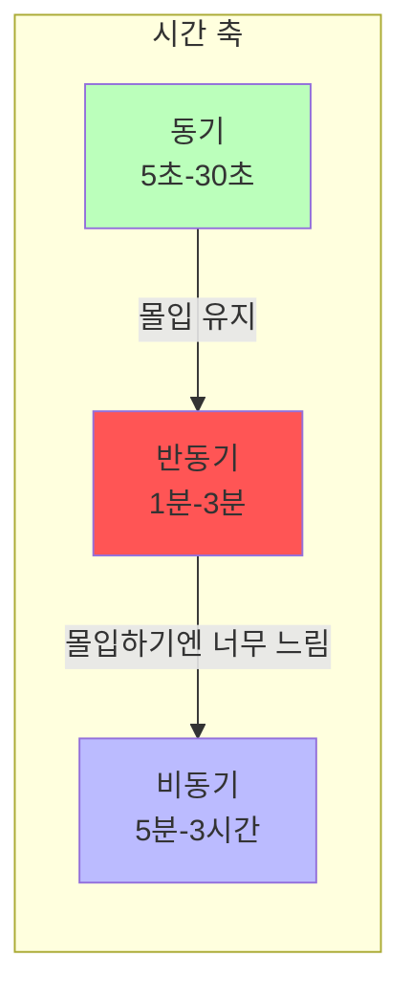

**반동기의 문제점:**
- **너무 느림**: 몰입 상태를 유지할 수 없음
- **너무 짧음**: 멀티태스킹을 할 수 없음
- **권장 사항**: 피하세요! 동기로 빠르게 하거나, 비동기로 길게 확장하세요

### 5.6 비동기 에이전트 활용의 어려움

> "비동기 에이전트를 관리하면 10배의 이득을 얻을 수 있다… 하지만 대부분의 사람은 동기 에이전트를 쓴다."

**왜 대부분의 사람은 동기 도구를 쓸까요?**

1. **관리는 어렵다** - 사람이든 에이전트든 마찬가지
2. **멀티태스킹이 필요하다** - 서로 다른 컨텍스트 사이를 빠르게 전환해야 함
3. **빠른 컨텍스트 파악이 필요하다** - 새 작업의 배경을 신속히 이해해야 함

---

## 6. 2025년의 프로그래밍 워크플로

### 6.1 워크플로 개요

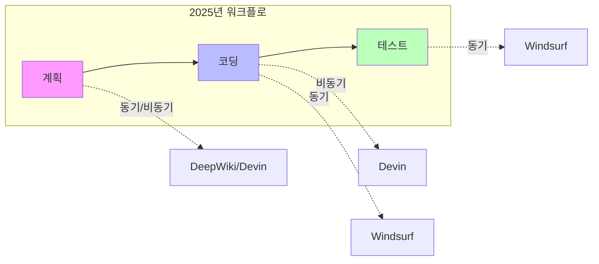

### 6.2 계획 단계

**추천 도구:**
- DeepWiki - 코드베이스 이해 및 문서화
- Ask Devin - AI의 계획 제안 받기
- Codemaps - 코드 구조 매핑
- Windsurf 안의 DeepWiki - 로컬 코드 이해

### 6.3 코딩 단계

**비동기 위임:**
```
1. Devin에게 작업 위임 (비동기)
2. AI 에이전트가 독립적으로 코딩 작업 완료
3. 사람은 다른 작업을 처리할 수 있음
```

### 6.4 테스트 단계

**일반적인 워크플로:**
```
1. Devin에게 작업 위임 (비동기)
2. Windsurf에서 변경 사항을 테스트하고 다듬기 (동기)
```

**미래 전망:**
> 비동기 에이전트가 스스로 테스트할 수 있게 된다면 레버리지는 더욱 커질 것입니다. 이는 서서히 현실이 되고 있습니다.

### 6.5 앞으로의 진화

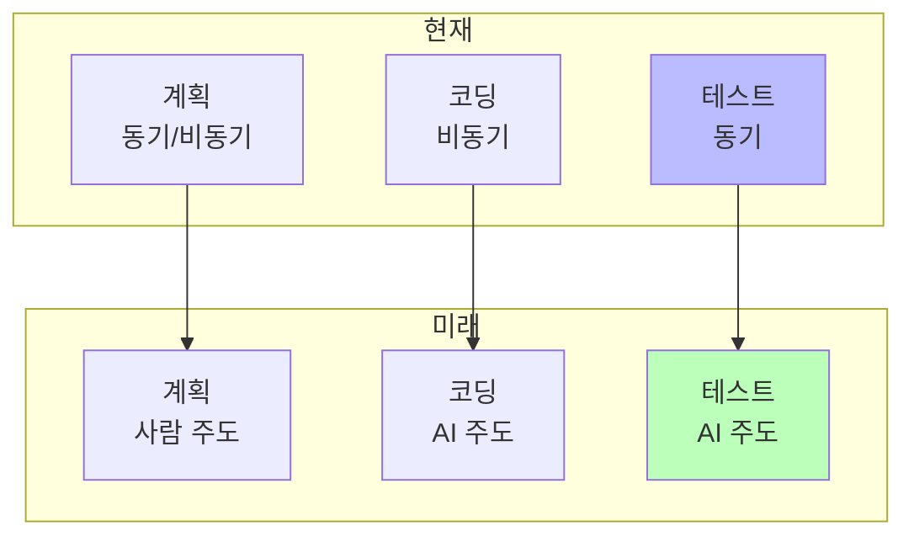

---

## 7. 모범 사례

### 7.1 효과적인 작업 설명 작성하기

간단한 변경에는 지나치게 상세한 프롬프트가 필요 없습니다. 하지만 복잡한 작업이라면 **프로덕트 매니저**가 되어 상세한 명세 문서를 작성해야 합니다.

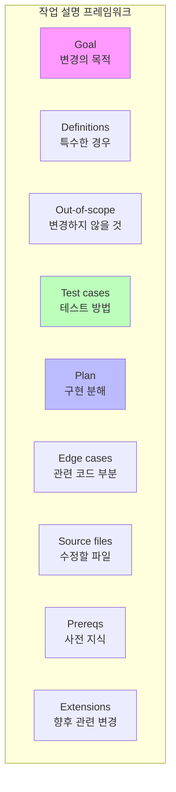

| 요소 | 질문 | 설명 |
|------|------|------|
| **Goal (목표)** | 변경의 목적은 무엇인가? | 명확한 목표 진술 |
| **Definitions (정의)** | 고려해야 할 특수한 경우는 무엇인가? | 경계 조건과 정의 |
| **Out-of-scope (범위 외)** | *변경하지 말아야* 할 것은 무엇인가? | 명확한 범위 제한 |
| **Test cases (테스트 케이스)** | 어떻게 테스트할 것인가? | 테스트 전략과 방법 |
| **Plan (계획)** | 상위 수준의 구현 분해 | 구현 단계 개요 |
| **Edge cases (엣지 케이스)** | 코드베이스의 어느 부분이 관련 있으며, 왜인가? | 주의할 경계 조건 |
| **Source files (소스 파일)** | 변경할 소스 파일 | 구체적인 파일 목록 |
| **Prereqs (사전 지식)** | LLM이 이 문제에 대해 알아야 할 사전 지식은? | 배경 지식 |
| **Extensions (확장)** | 나중에 관련될 변경은 무엇인가? | 향후 설계 고려 사항 |

### 7.2 코드베이스 최적화하기

> "사람과 에이전트 모두가 무슨 일이 일어나는지 이해할 수 있도록 코드베이스를 최적화하라"

**LLM이 혼란스러워하는 주된 원인**: 지저분한 저장소를 컨텍스트로 삼아 작업을 완료하려고 할 때입니다.

**최적화 관점:**

| 관점 | 내용 |
|------|------|
| **설명적 (Descriptive)** | 저장소 안내, 파일 구조 |
| **실행 가능 (Runnable)** | 설치 및 환경 설정 |
| **일관적 (Consistent)** | 모범 사례, 코드 스타일 |
| **접근 가능 (Accessible)** | 접근 패턴, API와 계약 |

**팁**: 저장소를 모노레포(monorepo)로 설계하는 것을 적극 권장합니다.

### 7.3 내비게이션 파일 설정

LLM이 코드베이스를 탐색하도록 돕는 설정 파일:

| 파일 | 용도 | 예시 내용 |
|------|------|-----------|
| **CLAUDE.md** | Claude가 자동으로 불러오는 컨텍스트 파일 | 자주 쓰는 명령, 핵심 파일, 코드 스타일, 테스트 방법 |
| **cursorrules** | Cursor의 규칙 설정 | 프로젝트 고유의 규칙과 선호 |
| **AGENTS.md** | 에이전트 지침을 위한 개방형 형식 | 범용 에이전트 가이드 |
| **llms.txt** | 웹을 수집하는 LLM을 위한 안내 | 웹에서 접근 가능한 프로젝트 문서 |

**CLAUDE.md 예시:**

```markdown
# 프로젝트 개요
프로젝트에 대한 간단한 설명

## 자주 쓰는 명령
- `npm run dev`: 개발 서버 시작
- `npm test`: 테스트 실행
- `npm run build`: 프로덕션 빌드

## 핵심 파일
- `src/index.ts`: 진입점
- `src/api/`: API 핸들러
- `src/utils/`: 유틸리티 함수

## 코드 스타일
- TypeScript 사용
- ESLint 규칙 준수
- 새 기능에는 테스트 작성

## 테스트
- 커밋 전에 `npm test` 실행
- 버그 수정 시 테스트 추가
```

**참고**: 에이전트가 이 설명/지침을 항상 따르지는 않습니다. 어디까지나 가이드 역할입니다.

---

## 8. 미래 전망

### 8.1 인간 엔지니어의 새로운 역할

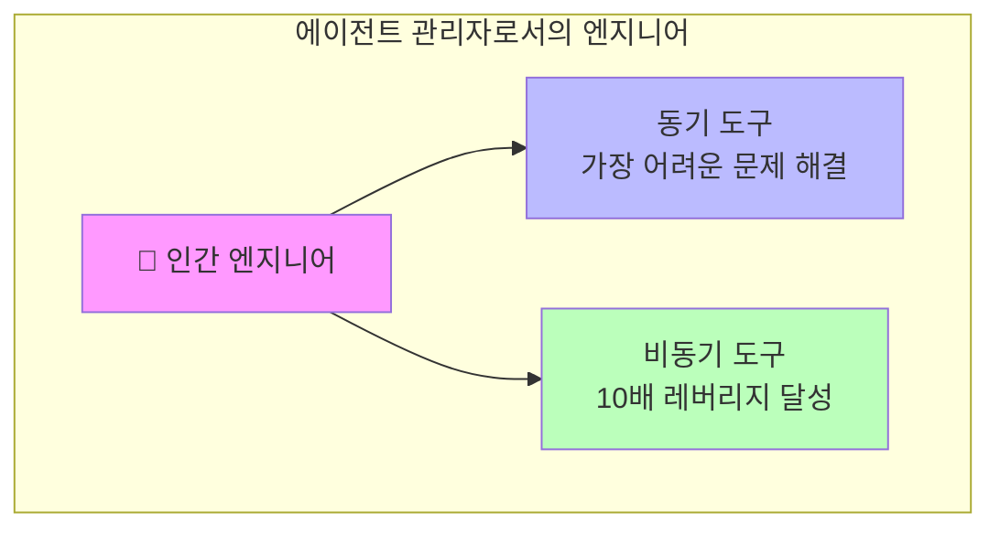

**인간 엔지니어는 에이전트 관리자가 될 것입니다:**
1. 동기 도구를 활용해 가장 어려운 문제를 해결
2. 비동기 도구를 활용해 10배의 레버리지를 달성

### 8.2 미래에 필수적인 역량

| 역량 | 설명 |
|------|------|
| **위임과 멀티스레딩** | 여러 에이전트에게 작업을 효과적으로 배분 |
| **코드 읽기** | AI가 생성한 코드를 빠르게 이해하고 리뷰 |
| **계획, 범위 설정, 아키텍처 설계** | 상위 수준의 설계 및 의사결정 능력 |

---

## 9. 실습 과제

### 실습 1: CLAUDE.md 설정하기
다음 내용을 담은 CLAUDE.md 파일을 만들어 보세요.
- 프로젝트 소개
- 자주 쓰는 명령
- 코드 스타일 가이드라인
- 테스트 방법

### 실습 2: 동기/비동기 도구 써 보기
1. Windsurf로 동기 코딩하기
2. Devin으로 비동기 작업하기
3. 사용 경험 비교하기
4. 여러 비동기 작업 사이를 전환하는 연습하기

### 실습 3: AI IDE 기능 탐색하기
1. 탭 완성 사용해 보기
2. 채팅 모드 사용해 보기
3. MCP 통합 살펴보기
4. 백그라운드 에이전트 테스트하기

### 실습 4: 작업 설명 작성하기
중간 난이도의 작업에 대해 9가지 요소를 모두 포함한 상세한 작업 설명을 작성해 보세요.

---

## 강의 자료

### 강의 5: AI IDE: 기초부터 파워 유저까지
- [슬라이드 (PDF)](../../slides/week3-lecture1-ide-setup.pdf)
- **게스트 연사**: Silas Alberti, Cognition (Head of Research)
- **일시**: 2025년 10월 10일, 오전 8:30 (PT), 420-041

### 강의 6: IDE ❤ Agents - 2025년 AI 코딩에 대한 주관적 가이드
- [슬라이드 (PDF)](../../slides/week3-lecture2-cognition.pdf)
- **게스트 연사**: Silas Alberti, Cognition 창립 멤버
- **핵심 내용**: 동기 vs 비동기 도구, 2025년 프로그래밍 워크플로, 미래 역량

---

## 읽기 자료

1. **[Claude Code 문서](https://docs.anthropic.com/en/docs/claude-code)**
2. **[Cursor 문서](https://cursor.sh/docs)**
3. **[Devin 문서](https://docs.devin.ai)**

---

## 과제

**[3장 과제](https://github.com/mihail911/modern-software-dev-assignments/tree/master/week3)**

AI IDE 환경에 익숙해지고 모범 사례를 익힙니다.

---

## 다음 장

[다음 장: 4장](./chapter4.md)

---
