# 4장: 프로그래밍 에이전트 패턴

## 강의 개요

개발자는 "직접 하는 사람"에서 "관리하는 사람"으로 전환하고 있습니다. 서브에이전트, 즉 에이전트가 에이전트를 관리하는 방식이 미래의 흐름입니다.

### 학습 목표
- 에이전트 관리 설계 패턴 이해
- Claude Code 사용법 숙지
- Hooks, Commands, Subagents 활용법 학습
- Anthropic 내부 활용 사례 이해

---

## 1. 개발 방식의 진화 흐름

### 1.1 개발자 역할의 진화

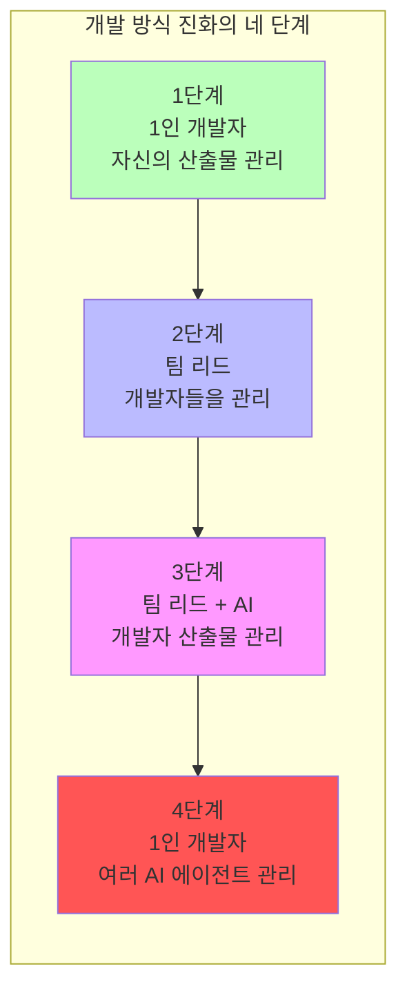

| 단계 | 역할 | 설명 |
|------|------|------|
| 1 | 1인 개발자 | 개발자 한 명이 자기 산출물을 관리 |
| 2 | 팀 리드 | 리드가 여러 개발자의 산출물을 관리 |
| 3 | AI 보조 팀 | 리드가 여러 개발자의 산출물을 관리 (AI 시스템의 보조) |
| 4 | 에이전트 관리자 | 개발자 한 명이 여러 AI 에이전트의 작업을 관리 |

### 1.2 소프트웨어 팀의 역사

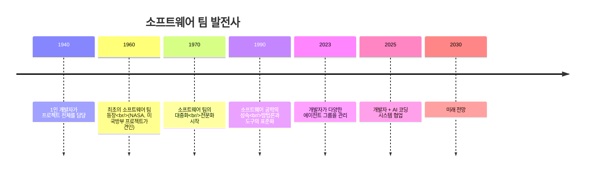

| 연도 | 이정표 | 주요 변화 |
|------|--------|-----------|
| 1940 | 1인 개발자 | 한 사람이 프로젝트 전체를 담당 |
| 1960 | 최초의 팀 | NASA, 미 국방부 프로젝트의 요구 |
| 1970 | 대중화 | 전문화 시작 |
| 1990 | 공학적 성숙 | 방법론과 도구의 표준화 |
| 2023 | 에이전트 그룹 관리 | 개발자가 다양한 에이전트를 관리 |
| 2025 | AI 협업 | 개발자 + AI 코딩 시스템 |
| 2030 | 미래 전망 | 에이전트가 에이전트를 관리 |

---

## 2. 프로그래밍 생산성의 기하급수적 성장

### 2.1 프로그래밍 언어 생산성의 진화

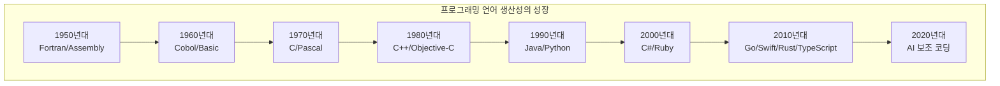

**핵심 통찰**: 프로그래밍 언어의 생산성은 AI에 힘입어 기하급수적으로 증가하고 있습니다.

### 2.2 IDE 생산성의 진화

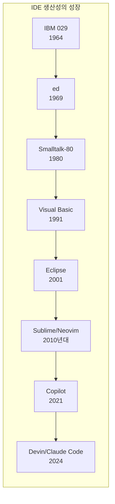

**핵심 통찰**: IDE의 생산성도 비슷한 기하급수적 성장을 보이며, 역시 AI가 이를 견인하고 있습니다.

### 2.3 검증 방법의 진화

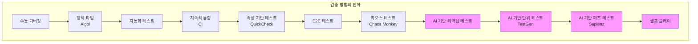

---

## 3. 소프트웨어 작업 단계와 책임 분담

### 3.1 작업 단계 개요

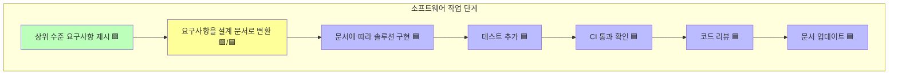

### 3.2 책임 분담 범례

| 색상 | 의미 | 수행 주체 |
|------|------|-----------|
| 🟩 초록 | 사람 주도 | 개발자 |
| 🟩/🟦 노랑 | 협업 | 개발자 + 에이전트 |
| 🟦 파랑 | 에이전트 주도 | AI 에이전트 |

---

## 4. 에이전트 관리 기법

### 4.1 네 가지 핵심 기술

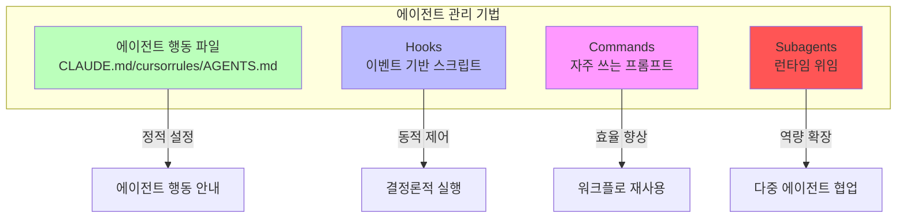

### 4.2 Hooks (훅)

> **정의**: 미리 정의된 이벤트 유형에서 실행되는 결정론적 스크립트

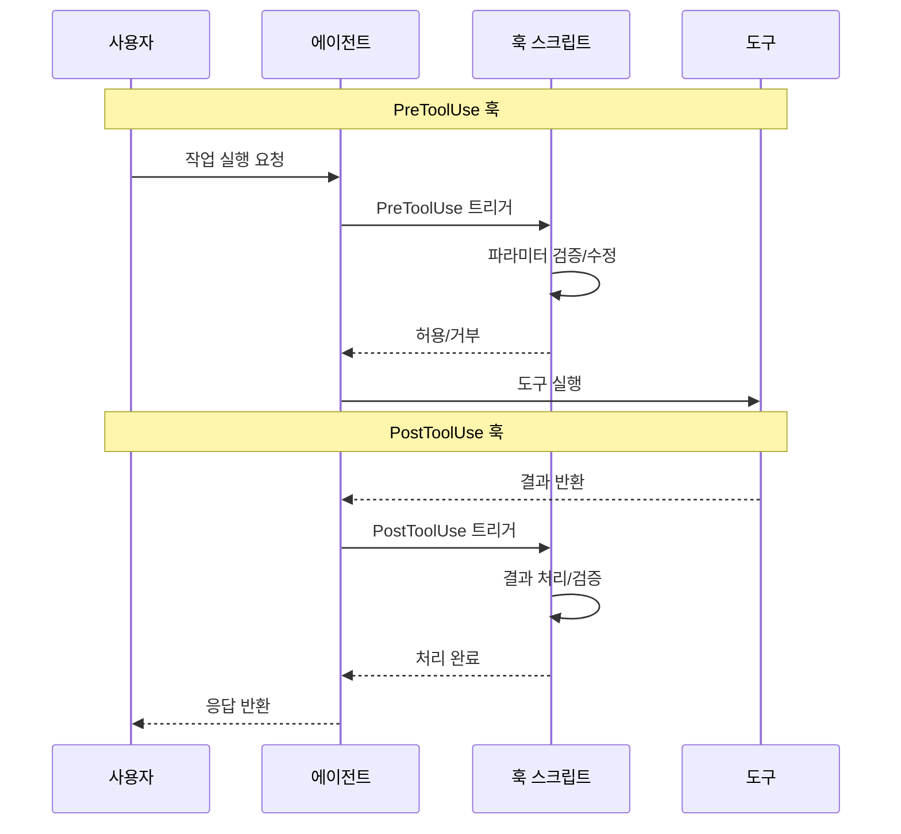

**훅 유형:**

| 훅 유형 | 실행 시점 | 대표적 용도 |
|---------|-----------|-------------|
| `PreToolUse` | 도구 사용 전 | 파라미터 검증, 제약 추가 |
| `PostToolUse` | 도구 사용 후 | 결과 검증, 로깅 |
| `UserPromptSubmit` | 사용자가 프롬프트를 제출할 때 | 입력 전처리 |
| `PreCompact` | 컨텍스트 압축 전 | 핵심 정보 보존 |
| `...` | 그 밖의 유형 | 계속 확장 중 |

### 4.3 Commands (커맨드)

> **정의**: 자주 쓰는 프롬프트를 파일로 만들어 에이전트가 실행하도록 제공

**활용 사례:**

| 상황 | 설명 |
|------|------|
| 테스트 실행 | 자동화된 테스트 워크플로 |
| 코드 리뷰 | 표준화된 리뷰 프로세스 |
| Git 작업 | 커밋, 푸시의 표준화 |
| 배포 | 배포 단계 자동화 |

**장점:**
- 자주 쓰는 워크플로 재사용
- 팀 차원의 표준화
- 반복 입력 감소

### 4.4 Subagents (서브에이전트)

> **정의**: 런타임 위임으로, 독립적인 개발자 페르소나를 생성

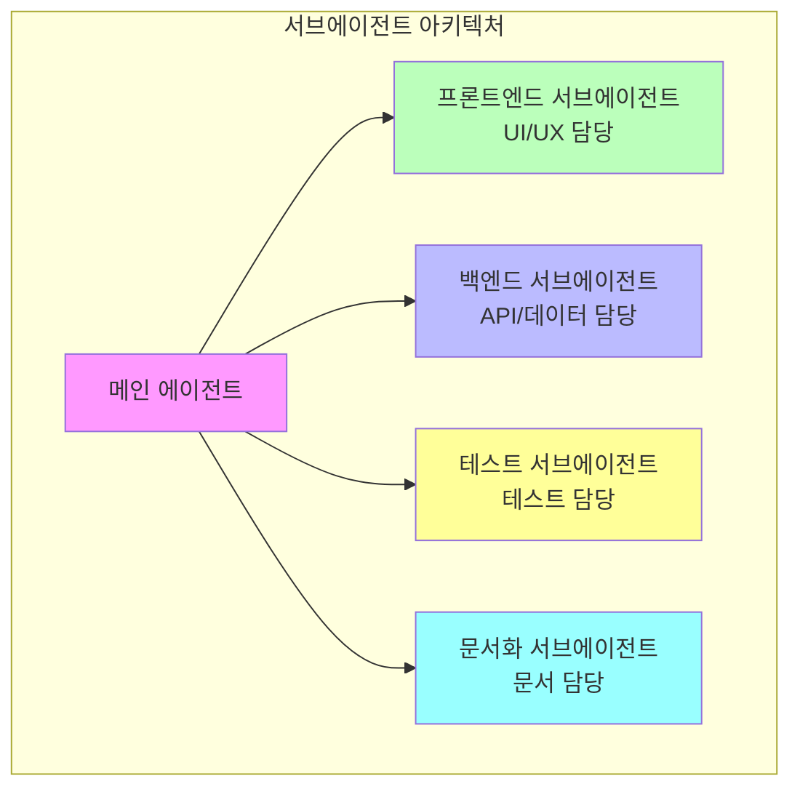

**서브에이전트의 목적:**

1. **서로 다른 개발자 페르소나 생성**
   - 프론트엔드 전문가
   - 백엔드 전문가
   - 테스트 전문가
   - 문서화 전문가

2. **컨텍스트를 깔끔하게 분리**
   - 독립된 워크플로 컨텍스트
   - 컨텍스트 오염 방지

3. **맞춤화 제공**
   - 맞춤형 시스템 프롬프트
   - 전용 도구 세트
   - 별도의 컨텍스트 윈도우

4. **에이전트가 에이전트를 관리하는 방향으로**
   - 계층적 관리
   - 전문화된 분업

**참고 자료:**
- [Awesome Claude Agents](https://github.com/vijaythecoder/awesome-claude-agents)
- [SuperClaude Framework](https://github.com/SuperClaude-Org/SuperClaude_Framework)

### 4.5 에이전트 행동 파일

| 파일 | 도구 | 용도 |
|------|------|------|
| `CLAUDE.md` | Claude Code | Claude가 자동으로 불러오는 컨텍스트 |
| `cursorrules` | Cursor | Cursor 규칙 설정 |
| `AGENTS.md` | 범용 | 개방형 형식의 에이전트 지침 |

---

## 5. Claude Code 심층 가이드

### 5.1 Claude Code의 접근 방식

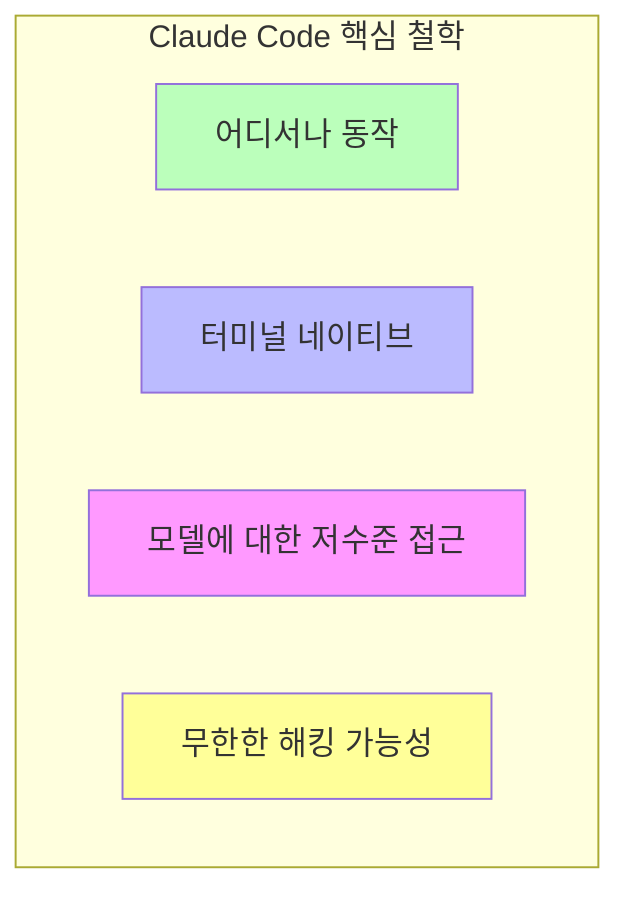

### 5.2 SDLC 전체를 포괄

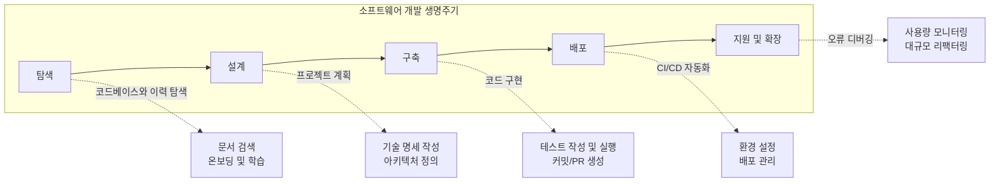

**팀의 CLI 도구 활용**: git, docker, bq 등 — 문법이 아닌 해결책에 집중하세요.

### 5.3 다양한 인터페이스

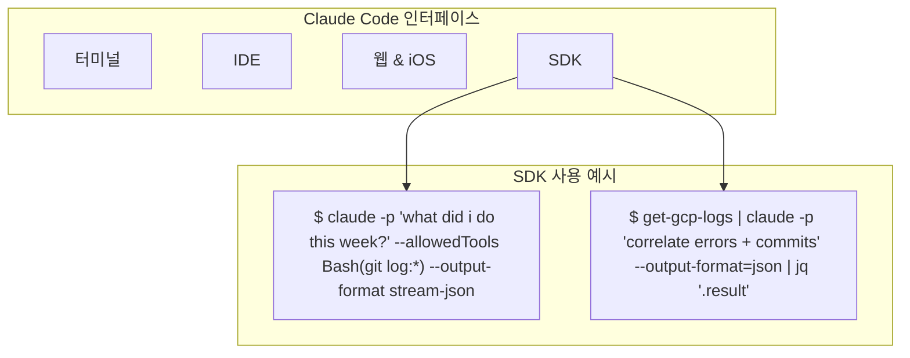

### 5.4 설치

```bash
npm install -g @anthropic-ai/claude-code
```

### 5.5 핵심 활용 사례

#### 활용 사례 1: 코드베이스 Q&A + 조사

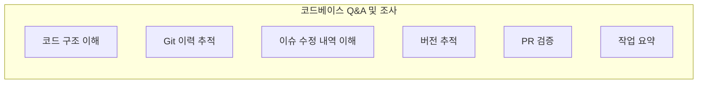

**질문 예시:**
```
> how do I make a new @app/services/ValidationTemplateFactory?
> why does recoverFromException take so many arguments? look through git history to answer
> why did we fix issue #18363 by adding the if/else in @src/login.ts api?
> in which version did we release the new @api/ext/PreHooks.php api?
> look at PR #9383, then carefully verify which app versions were impacted
> what did I ship last week?
```

(해석)
- 새 `@app/services/ValidationTemplateFactory`는 어떻게 만들지?
- `recoverFromException`은 왜 인자가 이렇게 많지? git 이력을 살펴보고 답해줘
- 이슈 #18363을 왜 `@src/login.ts` API에 if/else를 추가하는 방식으로 고쳤지?
- 새 `@api/ext/PreHooks.php` API는 어느 버전에서 릴리스했지?
- PR #9383을 보고, 어떤 앱 버전들이 영향을 받았는지 꼼꼼히 확인해줘
- 지난주에 내가 배포한 건 뭐였지?

#### 활용 사례 2: 코드 작성

| 모드 | 설명 |
|------|------|
| **1-shot** | 한 번에 완성, 단순한 작업에 적합 |
| **Sidekick** | 조수 모드, 인간-기계 협업 |
| **Prototype** | 빠른 프로토타이핑, 반복적 개선 |

#### 활용 사례 3: 도구 및 MCP 통합

```bash
# MCP Server 추가
$ claude mcp add barley_server -- node myserver

# MCP 사용
> use the barley mcp server to check for error logs
```

#### 활용 사례 4: 강력한 자동화

복잡한 워크플로를 자동화하여 반복 작업을 줄입니다.

### 5.6 작업에 맞춘 워크플로

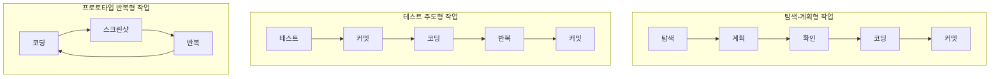

**워크플로 예시:**

**탐색-계획형:**
```
> figure out the root cause for issue #983, then propose a few fixes.
  Let me choose an approach before you code. ultrathink
```
(해석: 이슈 #983의 근본 원인을 찾은 뒤 몇 가지 수정안을 제안해줘. 코딩하기 전에 내가 방법을 고를게. ultrathink)

**테스트 주도형:**
```
> write tests for @utils/markdown.ts to make sure links render properly
  (note the tests won't pass yet, since links aren't yet implemented).
  then commit. then update the code to make the tests pass.
```
(해석: `@utils/markdown.ts`에 링크가 제대로 렌더링되는지 확인하는 테스트를 작성해줘. 링크 기능이 아직 구현되지 않았으니 테스트는 아직 통과하지 않을 거야. 그다음 커밋하고, 테스트가 통과하도록 코드를 수정해줘.)

**프로토타입 반복형:**
```
> implement [mock.png]. Then screenshot it with puppeteer and iterate
  till it looks like the mock.
```
(해석: [mock.png]를 구현해줘. 그다음 puppeteer로 스크린샷을 찍고, 목업과 똑같아 보일 때까지 반복해줘.)

### 5.7 프로토타입 반복 예시

Claude Code가 UI 디자인을 빠르게 반복 개선하는 과정을 보여줍니다.

```
> make it so instead of todos showing up as they come in, we hide the
  tool use and result for todos, and render a fixed todo list above
  the input. title it "/todo (1 of 3)" in grey

> actually don't show a todo list at all, and instead render the tool
  uses inline, as bold headings when the model starts working on a todo

> also add a todo pill under the text input, similar to bg tasks

> actually undo both the pill and headings. instead, make the todo list
  render to the right of the input, vertically centered with a grey divider

> instead of showing todos above the input, merge them into the spinner.
  show the current todo as the spinner message in active verb form
```

(해석)
1. 할 일(todo)이 들어오는 대로 표시하지 말고, todo의 도구 사용과 결과는 숨긴 채 입력창 위에 고정된 할 일 목록을 렌더링해줘. 제목은 회색으로 "/todo (1 of 3)"
2. 아니다, 할 일 목록은 아예 보여주지 말고, 모델이 할 일을 시작할 때 도구 사용을 굵은 제목으로 인라인 렌더링해줘
3. 백그라운드 작업처럼 텍스트 입력창 아래에 todo 알약(pill) 표시도 추가해줘
4. 아니다, 알약과 제목 둘 다 되돌려줘. 대신 할 일 목록을 입력창 오른쪽에, 회색 구분선과 함께 세로 가운데 정렬로 렌더링해줘
5. 할 일을 입력창 위에 보여주는 대신 스피너에 합쳐줘. 현재 할 일을 진행형 동사 형태의 스피너 메시지로 표시해줘

---

## 6. 모범 사례

### 6.1 안전장치

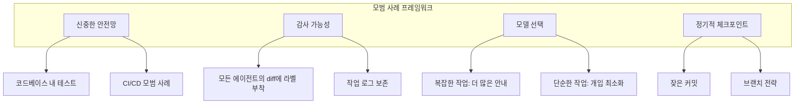

### 6.2 핵심 원칙

| 원칙 | 설명 |
|------|------|
| **안전장치** | 테스트, CI/CD, 보안 점검 |
| **감사 가능성** | 모든 에이전트의 diff에 라벨을 달고 로그 보존 |
| **모델 선택** | 작업에 따라 다른 모델 사용 |
| **정기적 체크포인트** | 쉽게 되돌릴 수 있도록 자주 커밋 |

### 6.3 열린 질문

1. **조사 단계의 자동화**
   > 모든 작업에서 처음 10-20%를 차지하는 조사 단계를 어떻게 자동화할 수 있을까?

2. **작업 큐 관리**
   > 대기 중인 작업 큐를 어떻게 유지할 것인가 (일회성 변경이라면 더 쉬움)?

---

## 7. Anthropic 내부 활용 사례 연구

> 읽기 자료 **How Anthropic Uses Claude Code** 를 바탕으로 함

### 7.1 팀별 Claude Code 활용 사례

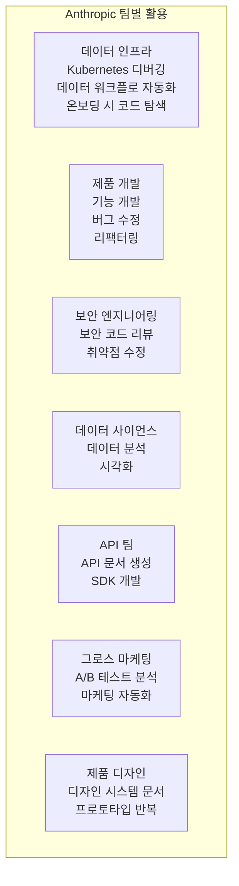

| 팀 | 활용 사례 |
|----|-----------|
| **데이터 인프라** | Kubernetes 디버깅, 데이터 워크플로 자동화, 온보딩 시 코드 탐색 |
| **제품 개발** | 기능 개발, 버그 수정, 리팩터링 |
| **보안 엔지니어링** | 보안 코드 리뷰, 취약점 수정 |
| **데이터 사이언스** | 데이터 분석, 시각화 |
| **API 팀** | API 문서 생성, SDK 개발 |
| **그로스 마케팅** | A/B 테스트 분석, 마케팅 자동화 |
| **제품 디자인** | 디자인 시스템 문서화, 프로토타입 반복 |

### 7.2 모범 사례 요약 (Anthropic 팀들로부터)

1. **상세한 CLAUDE.md 파일** - 문서가 상세할수록 Claude Code의 성능이 좋아짐
2. **MCP 서버 활용** - Claude Code의 기능 확장
3. **스크린샷 활용** - 기대하는 화면을 스크린샷으로 보여주기
4. **점진적 개발** - 한 번에 한 단계씩 구현
5. **세션 종료 시 문서화** - 완료한 작업을 요약하고 워크플로 개선

---

## 8. 핵심 교훈

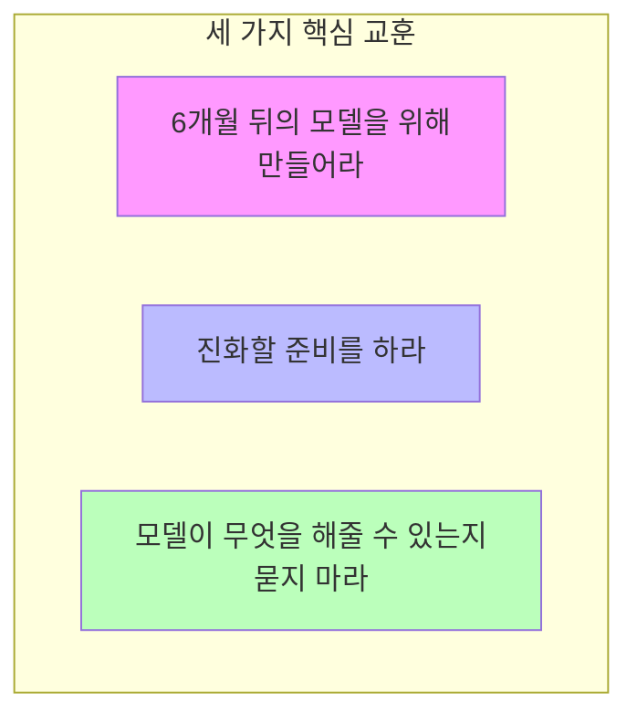

### 8.1 핵심 통찰

1. **6개월 뒤의 모델을 위해 만들어라**
   - 모델의 능력은 빠르게 향상되고 있음
   - 오늘의 설계는 미래의 능력을 고려해야 함

2. **진화할 준비를 하라**
   - 도구와 방법론이 빠르게 변하고 있음
   - 학습과 적응 능력을 유지할 것

3. **모델이 무엇을 해줄 수 있는지 묻지 마라**
   - 모델에게 더 나은 컨텍스트를 어떻게 제공할지 고민할 것
   - 워크플로를 능동적으로 최적화할 것

### 8.2 생산성 동향

- **프로그래밍 언어 생산성**: 기하급수적으로 증가 중 (AI 주도)
- **IDE 생산성**: 비슷한 기하급수적 성장
- **검증 방법**: AI 기반 테스트가 주류가 되어 가는 중

---

## 9. 실습 과제

### 실습 1: CLAUDE.md 설정하기
다음 내용을 담은 프로젝트용 CLAUDE.md를 작성하세요.
- 프로젝트 소개
- 자주 쓰는 명령
- 코드 스타일
- 테스트 방법

### 실습 2: Claude Code 사용하기
1. Claude Code 설치
2. 코드베이스 탐색
3. 코드 작성해 보기
4. 다양한 워크플로 패턴 연습

### 실습 3: MCP 추가하기
MCP Server를 추가해 보세요.
```bash
claude mcp add barley_server -- node myserver
```

### 실습 4: 훅 설정하기
파일 수정 전에 검증을 수행하는 PreToolUse 훅을 만들어 보세요.

### 실습 5: 서브에이전트 사용하기
작업별로 전문화된 서브에이전트 설정을 만들어 보세요.

---

## 강의 자료

### 강의 7: 에이전트 관리자가 되는 법
- [슬라이드 (PDF)](../../slides/week4-lecture1-agent-manager.pdf)
- **게스트 연사**: Boris Cherny, Anthropic (Claude Code 개발자)
- **일시**: 2025년 10월 17일

### 강의 8: Claude Code에 오신 것을 환영합니다
- [슬라이드 (PDF)](../../slides/week4-lecture2-claude-code.pdf)
- **연사**: Boris Cherny
- **핵심 내용**: Claude Code 아키텍처, 활용 사례, 모범 사례

---

## 읽기 자료

### 필수
1. **[Claude Code 공식 문서](https://docs.anthropic.com/en/docs/claude-code)**
2. **[How Anthropic Uses Claude Code (PDF)](../../readings/how-anthropic-uses-claude-code.pdf)**

### 추천 자료
1. **[Awesome Claude Agents](https://github.com/vijaythecoder/awesome-claude-agents)**
2. **[SuperClaude Framework](https://github.com/SuperClaude-Org/SuperClaude_Framework)**

---

## 과제

**[4장 과제](https://github.com/mihail911/modern-software-dev-assignments/tree/master/week4)**

에이전트 관리 기법을 연습하고 맞춤형 워크플로를 만들어 봅니다.

---

## 다음 장

[다음 장: 5장](./chapter5.md)

---
